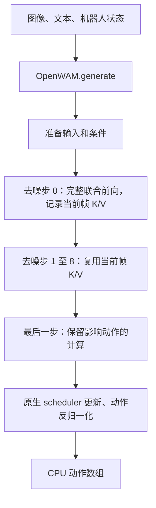
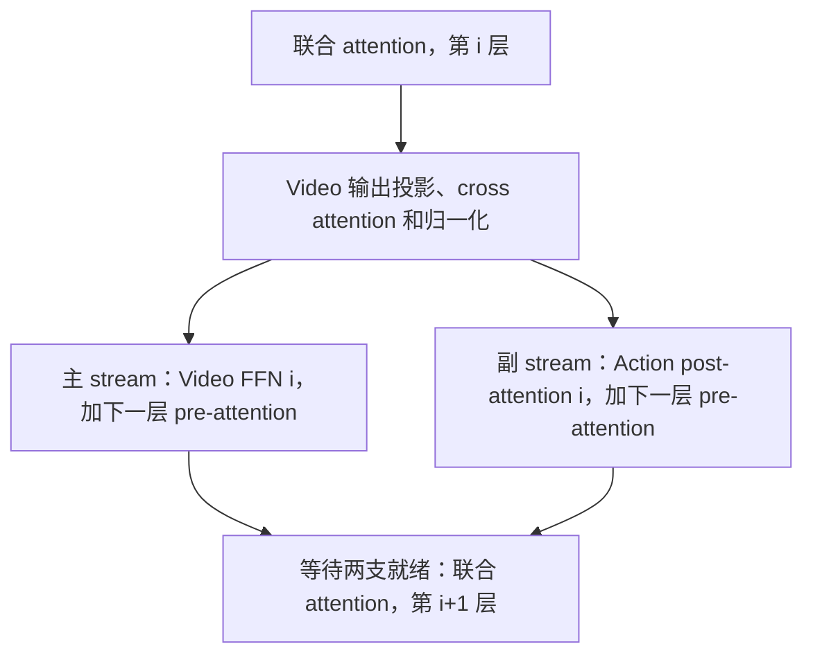

# 沿着一次推理读懂 2242 行代码

这是 [RealtimeWAM 论文](https://arxiv.org/abs/2610.10079)的 OpenWAM 外接实现。Parallel 始终启用，`reuse_tokens` 和 `adaptive_2f4f` 是两个独立、默认关闭的有损开关。没有额外 baseline 模式；FastWAM 和完整论文评测入口尚未包含。

这套代码做的是**给现有 OpenWAM 增加一条更快的执行路径**。原库提供模型定义、权重、采样规则和归一化；这里组织计算顺序，准备可复用的中间结果，并调用更合适的 GPU 算子。

先区分三个数量：默认请求执行 **10 个去噪步**，每步经过 **30 层 Transformer**，最终返回 **32 个动作时间点**。步数、网络层数、输出动作数量是三个不同维度。

## 文件地图

| 文件 | 行数 | 负责的事情 | 先看哪里 |
| --- | ---: | --- | --- |
| [`runtime.py`](WAMInfer/runtime.py) | 404 | 接口、采样循环、准备与释放资源 | `OpenWAM.generate`、`Runtime._generate` |
| [`preparation.py`](WAMInfer/preparation.py) | 214 | 图像/文本准备、条件 K/V、时间调制、当前帧 prefill | `prepare_inputs`、`ConditioningPreparation` |
| [`blocks.py`](WAMInfer/blocks.py) | 290 | 适配原模型，将每层拆成可调度的阶段 | `View`、两个 Adapter |
| [`approximation.py`](WAMInfer/approximation.py) | 84 | token 预算与历史、运动自适应决策 | `TokenReuse`、`MotionRefinement` |
| [`joint.py`](WAMInfer/joint.py) | 165 | Video/Action 双 stream 调度、联合 attention | `ParallelJointLoop._run` |
| [`graphs.py`](WAMInfer/graphs.py) | 257 | CUDA Graph、输入刷新、文本和 VAE 执行 | `CudaGraphForward._replay` |
| [`ffn.py`](WAMInfer/ffn.py) | 118 | 准备 FFN 权重布局和 cuBLASLt 执行计划 | `PreparedFFN.prepare/forward` |
| [`_triton_inference.py`](WAMInfer/_triton_inference.py) | 221 | 融合归一化、调制、残差和 RoPE | `_modulated_norm`、`_qk_rms_rope_kernel` |
| [`_triton_attention.py`](WAMInfer/_triton_attention.py) | 484 | 不同 mask/缓存布局的 attention kernel | `_attention_kernel`、`_split_attention_kernel` |
| [`__init__.py`](WAMInfer/__init__.py) | 5 | 导出 `OpenWAM` 和 `accelerate` | 整个文件 |
| **核心 Python 合计** | **2242** | 包括注释和空行 | |

另外还有 `_cublaslt_inference.cpp` 197 行、`_inference_guards.cpp` 214 行。benchmark 和测试不计入核心行数。两个开关及后续缓存优化相对 v0.1.0 净增 221 行核心 Python，只增加一个实现文件。

## 1. 入口：接入原模型

[`OpenWAM.__init__`](WAMInfer/runtime.py) 调用原库加载 checkpoint，将原 architecture 保存到 `original`，再创建 `Runtime(original)`。

`Runtime`、`VideoAdapter`、`ActionAdapter` 通过 [`View`](WAMInfer/blocks.py) 访问原对象：本地没有的属性转发给 `_native`。因此模型的 block、层参数和 scheduler 继续来自原模型；外接层会额外建立打包权重、缓存和工作空间，但没有另造一套模型定义。

`OpenWAM.generate` 负责方便调用：构造原生同步 schedule、归一化 proprio，交给 `Runtime.generate`。后者用锁保证同一个 runtime 的请求顺序执行，因为静态 Graph 输入和 FFN 工作空间会被复用。

整个调用链如下：

图中是默认 10 步、只返回动作的情况。请求视频时，最后一步保留完整视频路径。

## 2. 准备：把不随去噪步变化的工作提前做

[`prepare_inputs`](WAMInfer/preparation.py) 准备图像 latent、文本 embedding 和初始视频噪声。图像 VAE 编码提交到独立 CUDA stream，使它能与文本/噪声准备重叠；真正使用图像 latent 前，主 stream 会等待它完成。

这里有几种生命周期不同的复用：

| 对象 | 可以复用到什么时候 | 什么变化会使它失效 |
| --- | --- | --- |
| 最近一次文本编码结果 | 后续相同 prompt 请求 | prompt、tokenizer、device 或相关权重变化 |
| 各层 context K/V | 本次请求的全部去噪步 | 每次请求重新投影，包含当前 proprio |
| 所有步的时间 embedding/modulation | 相同 schedule 和几何条件的请求 | schedule、shape、dtype、device、相关权重等变化 |
| 当前帧各层 K/V | 本次请求的后续去噪步 | 新请求重新构建 |
| CUDA Graph 执行结构 | 输入结构和准备状态仍兼容时 | 输入结构、几何或权重准备变化 |

`ConditioningPreparation._project` 一次性计算 Video/Action 各层的 cross-attention K/V。在一个请求中，文本和 proprio 不随去噪步变化，因此不需要在 10 个步里反复做同样的条件投影。这里复用的是**条件的 K/V**；随去噪状态变化的 Q 仍需重新计算。

`_prepare_time` 提前算出 schedule 中所有步的时间调制；每步只用 GPU 上的 index 取对应项。

## 3. 采样：10 次网络预测与状态更新

[`Runtime._generate`](WAMInfer/runtime.py) 是总控制循环。每一步取得当前时间条件，运行联合网络，用原生 flow scheduler 更新动作，并更新未来视频 latent。当前观测对应的 latent 会重新固定为输入图像的编码。

动作有一些非激活维度。这些维度遵循原模型规定的解析噪声路径。代码每请求在 CPU 解析一次掩码，生成整数索引并上传；每步继续执行原来的噪声更新规则。移到 CPU 的是整数/布尔准备，没有改动作的浮点更新。

第一次多帧前向还负责建立当前帧 K/V；后面的前向使用它。普通步与最后的动作步分别有 Graph，避免为最后一步的特殊结构反复重新捕获。

## 4. 当前帧为什么可以只算一次

默认审计几何中，9 个视频帧经过 VAE 后成为 3 个 latent 帧，Transformer 中共 360 个视频 token：当前帧 120 个、未来帧 240 个，另有 32 个 Action token。

当前帧满足两个关键条件：时间步固定为零，`first_frame_causal` mask 使其查询不读取未来视频和 Action。于是，在同一个请求中，固定观测、条件和权重决定了当前帧每层的结果；其他 token 的去噪状态变化不会改变它。

第一次前向记录每层的当前帧 K/V。后续步的 Transformer 分支只重算未来视频和 Action；联合 attention 仍然能读取那 120 个当前帧的 K/V。输入准备等外围操作并非全部省略。

[`FirstFramePreparation`](WAMInfer/preparation.py) 和 [`ParallelJointLoop._run`](WAMInfer/joint.py) 共同完成这件事。缓存按请求重建，未来帧不套用这个结论，因为它们的状态确实在变化。

## 5. 真正的并行在 joint.py

每层都有联合 attention：Video 和 Action 必须先准备好 Q/K/V，才能计算彼此需要的信息。因此两个分支有反复出现的会合点。

当前一层的调度大致如下，省略最后一层的特殊情况：

实现位置是 `_run` 中的 `torch.cuda.stream(side)`、`side.wait_stream(main)` 和 `main.wait_stream(side)`。两个 stream 在同一块 GPU 上执行，硬件资源仍然共享；有并发提交并不意味着计算能力翻倍。

为什么先完成 Video 的投影，再启动 Action？测量发现，Action 与这些较小的 Video 投影一起运行时，Video 会变慢。把重叠窗口移到 Video FFN，虽然 FFN 自身也可能变慢，但整个关键路径更短。

`_BranchPhase` 把“本层剩余计算”和“下一层 Q/K/V 准备”合成一个可编译阶段。**这里的 phase 不等于单独一层，也不等于一个 GPU kernel。** 一个 phase 内仍可能启动多个 kernel。

## 6. blocks.py：把模型拆成可执行阶段

两个 Adapter 管理的主要是状态与边界：

- `prepare/prepare_state`：把 latent、条件和时间信息整理为 `VideoState`、`ActionState`。
- `pre_attn_at_layer_for_compile`：残差/归一化/调制，生成 Q/K/V，再进行 Q/K RMSNorm 和 RoPE。
- `post_attn_at_layer_for_compile`：联合 attention 之后的输出投影、cross attention 等；Video 在 FFN 前返回，给调度器一个启动 Action 的位置。
- `ffn_at_layer_for_compile`：Video 的 FFN 和残差处理。
- `finalize/extract_prediction`：从隐藏状态得到本步视频/动作预测。

`prepare_packed_weights` 将 Q/K/V 或 K/V 权重打包，让一次较大的线性投影代替多个独立投影；权重变化后会刷新这些非持久 buffer。

还有一处跨层融合：Video FFN 的门控残差先记录到 `state.extras`，下一层归一化时一起处理，减少中间张量读写。它没有跳过这个残差。

## 7. torch.compile 与 CUDA Graph 各自省什么

`joint.py` 用 `torch.compile` 编译阶段，减少 Python 调度并融合能够合并的操作。编译结果仍可能包含 Triton kernel 和库调用。

[`CudaGraphForward`](WAMInfer/graphs.py) 在预热后捕获固定的 GPU 执行结构，后续请求刷新静态输入，再 `graph.replay()`。它减少重复提交开销；每次 replay 都会实际执行模型计算。

其中三个细节与结果正确性直接有关：

1. 输入 shape、stride、dtype 或嵌套结构变化时，需要重新捕获。
2. 同一个 Tensor 如果内容版本变了，就要重新复制输入；不能只看 Python 对象地址。
3. 默认克隆返回结果。token 复用的首轮 Graph 在本次请求内借用输出，并更新 Tensor 版本，让下游识别新内容；跨请求的 FFN 历史打包后保存独立副本，成功结束才提交。

普通 Graph 与最后动作 Graph 顺序执行，能够共享输入缓冲区、版本记录和内存池。共享的前提由代码检查。

`graphs.py` 还管理 T5 和 VAE：文本缓存最近一次结果；VAE 的单帧因果 3D 卷积可以取对应的时间切片执行 2D 卷积。VAE 捕获过程中会临时绑定 `forward`，在 `finally` 中恢复，所以“不改原库源码”不意味着从来没有临时运行时适配。

## 8. 真正手写的 GPU 算子

两个 `_triton_*.py` 文件共 **705 行**。这些代码通过 Triton 编译为 GPU kernel。内部调用方负责提供满足既有 CUDA BF16、形状和布局约定的张量；原先只报错的重复参数检查已删除，kernel 数学和启动配置不变。

`_triton_inference.py` 处理偏逐元素/归一化的计算：Q/K RMSNorm 与 RoPE 融合，以及残差、门控、LayerNorm 和时间调制融合。减少 kernel 启动和中间结果往返显存是主要目的。BF16 舍入位置被明确保留，RoPE 的相关旋转使用 FP64；不能为快一点直接降低精度。

`_triton_attention.py` 计算 attention，逐块维护 softmax 的最大值、归一化和加权输出，避免先完整存下整个注意力矩阵。它包含通用 mask、首步当前帧因果结构，以及后续步分离的当前帧/未来帧/Action K/V 布局。分离布局可以直接读取多个 bank，省掉每层拼接 K/V。

多种 kernel 对应不同几何、mask 和硬件条件。它们共同支撑一条 Parallel 模式，不是又增加了多种部署模式。

## 9. FFN 为什么还需要 C++

FFN 的主体是两次大矩阵乘，中间经过 GELU。这里在 Ada 上使用 cuBLASLt：[`PreparedFFN`](WAMInfer/ffn.py) 整理权重布局、按形状准备 plan，`_cublaslt_inference.cpp` 调用 NVIDIA 的矩阵乘实现，将 bias/GELU 放进相应 epilogue。

准备阶段选择算法并分配工作空间；热路径绑定当前张量后直接执行，不在 Graph 捕获中调优。其他受支持硬件或未准备几何使用代码中的原 FFN 路径。

另一个 C++ 文件 `_inference_guards.cpp` 运行在 CPU，快速检查模型状态和输入结构，帮助判断何时必须刷新权重/缓存或重新捕获。两份 C++ 扩展都不是手写 PTX；真正的 GPU GEMM 来自 cuBLASLt。

这里的 guard 参与结果正确性：更换权重后要刷新打包权重和条件缓存，输入形状或布局变化后要重建 Graph。`graphs.py` 还检查 Tensor 版本，以发现同一对象的原地修改。这些逻辑继续保留，不能像只负责报错的内部参数检查一样直接删除。

因此本仓库同时使用 **PyTorch、Triton、cuBLASLt、CUDA Stream 和 CUDA Graph**。它们处在执行链的不同位置；这里没有 CuTe、TileLang 或 cuTile 实现。

## 10. 可以删掉的最后一点计算

只返回动作时，最后一个去噪步、最后一层联合 attention 之后，后续 Video 投影、FFN、输出头和 latent 更新已经不会影响动作。代码跳过这些尾部工作。

最后一次联合 attention 之前的 Video K/V 仍被 Action 使用，所以仍需计算。请求视频输出时，尾部也要保留。单步采样承担当前帧 prefill 的路径继续执行完整前向。

`close()` 则释放 Graph、FFN plan 和附加 buffer，恢复外接前的原模型使用方式；这个过程也有测试。

## 11. 两个有损开关具体省在哪里

`reuse_tokens=True` 省的是**不同观测之间部分当前帧 token 的 FFN**。第一层完整计算；RGB 变化超过 5/255 的位置必须刷新，并为其他位置预留 25% 名额。所需数量向上取一个固定容量（默认 32/64/96/120），剩余名额用第一层特征变化排序填满，分数相同时按位置顺序决定。后续层把选中的当前帧行与所有未来帧行一起送进 FFN，再把结果写回缓存。没有选中的位置保留上次 FFN 输出；attention 和本次残差门控继续重算。

缓存历史只在请求成功完成后提交一次，CUDA Graph 预热和捕获不推进历史。不同 token 容量各自保留 Graph，切换容量时无需反复捕获。首个观测、prompt/权重/几何变化后全量刷新；新 episode、相机或裁剪方式变化时调用 `model.reset()`。这与第 4 节的请求内 K/V 复用是两件事。

`adaptive_2f4f=True` 省的是**去噪过程中的完整 Transformer 计算**。仍有 10 次 Euler 更新，但先只在第 0、3 次更新刷新 Transformer 的输入到输出残差。其他步重新嵌入本次 latent，加上缓存残差，再计算本步输出头，没有直接复用旧速度预测。第 3 次完整前向后，从粗动作估计位移；不超过 0.08 米则再计算第 6、9 次完整前向，否则使用 2F。两条路径从同一个前缀继续。

位移由 `motion_metric(actions)` 回调返回，输入是反归一化后的 NumPy 动作，输出单位是米。绝对 XYZ 动作可以直接减当前末端位置；关节动作要先做正运动学；增量控制要匹配控制器的限幅、尺度和累加方式。机器人相关逻辑放在调用方，推理包不用加入一套机器人配置框架。

两个开关默认关闭，关闭时不创建跨观测 FFN 历史、不跳 Transformer。开启时允许近似，不能再把结果称为无损。`model.architecture.last_stats` 可以查看本次实际完整计算的位置和 token 数量。

## 建议阅读顺序

先读 `runtime.py` 的 `_generate`，明确 10 步循环；再读 `joint.py` 的 `_run`，看每层哪里分叉、哪里会合。接着读 `blocks.py` 理解各阶段的输入输出，再看 `preparation.py` 与 `graphs.py` 的缓存生命周期。最后深入 Triton 和 FFN 实现。

最近增量优化的逐字节一致性基准是固定 FFN 的已有 Parallel。历史融合相对原生 eager 的数值边界、性能测量条件和被排除方案见 [验证记录](VALIDATION.md)。
