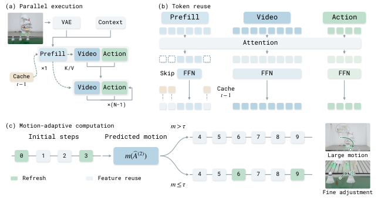

<div align="center">

# RealtimeWAM: How Fast Can I Run<br>My World Action Model?

**WAMInfer · OpenWAM inference code for RealtimeWAM**

Huanan Liu, Ye Li, Kangye Ji, Xiaoyu Chen, Hanyun Cui, Yutian Shen,<br>
Yuan Meng, Chenglei Wu, Jingyan Jiang, Bo Li, and Zhi Wang

Tsinghua University · YuanxingGuangnian Robotics · Nanjing University

[](https://arxiv.org/abs/2610.10079)
[](https://github.com/Na2Ssss/WAMInfer/releases/tag/v0.2.0)
[](LICENSE)

[Paper](https://arxiv.org/abs/2610.10079) · [Method](#method) · [Results](#results) · [Getting started](#getting-started) · [中文源码导读](CODE_GUIDE.md)

</div>

> **TL;DR:** Coordinate parallel execution, observation-token reuse and motion-adaptive refinement to make existing World Action Models respond faster, without additional training.

## Abstract

World Action Models jointly model visual dynamics and actions, but inference latency limits their responsiveness. **RealtimeWAM** combines three ideas: overlap independent computation, reuse observation features selectively, and allocate refinement according to predicted motion. Together, they address execution scheduling and the amount of fresh computation within each request. The paper evaluates FastWAM and OpenWAM across RoboTwin, LIBERO, LIBERO-Plus and real-world tasks. **WAMInfer** provides an external OpenWAM runtime with Parallel enabled by default and independent switches for the two approximate methods.

## News

- **2026-10-10:** [v0.2.0](https://github.com/Na2Ssss/WAMInfer/releases/tag/v0.2.0) adds optional token reuse and adaptive 2F/4F to the OpenWAM runtime.
- **2026-10-07:** [RealtimeWAM](https://arxiv.org/abs/2610.10079) is available on arXiv.

## Method

<p align="center">
  
</p>

*Method overview from [Figure 4 of the paper](https://arxiv.org/html/2610.10079v1#S3.F4). The three components coordinate computation within a request and reuse across observations.*

**1. Dependency-aware parallel execution.** Schedule observation processing and prediction according to their layerwise dependencies. In the released runtime, Video and Action phases overlap around joint attention, supported by compiled phases, fused operators, prepared conditioning and CUDA Graph replay.

**2. Hardware-aware token reuse.** Refresh observation FFN rows selected by RGB changes and first-layer feature changes. Round the refresh count to a prepared execution capacity, using available capacity for additional informative tokens. Attention and current residual gates remain fresh.

**3. Motion-adaptive refinement.** Use a coarse action prediction to choose between **2F** and **4F**. Large predicted movements use fewer full Transformer evaluations; small adjustments receive additional refinement. Both paths retain **ten Euler updates**, with current latent embeddings and output heads at every update.

| Full Transformer refresh | Euler-update indices, zero-indexed |
| --- | --- |
| Shared prefix — **2F** | 0, 3 |
| Additional refinement — **4F** | 0, 3, 6, 9 |

At other updates, cached Transformer residuals are added to the current embeddings. The runtime does not simply replay an old velocity prediction.

## Results

### Paper benchmarks

The following values are reported in [Table 1 of the paper](https://arxiv.org/html/2610.10079v1#S4.T1), averaged equally across RoboTwin clean/randomized, LIBERO and LIBERO-Plus. Latency is measured on an RTX 4090 with 48 GiB memory; speedup is relative to each backbone's native inference.

| Backbone | Latency: Native → RealtimeWAM | Speedup | Success rate: Native → RealtimeWAM |
| --- | ---: | ---: | ---: |
| FastWAM | 214.33 → **24.09 ms** | **8.90×** | 82.77 → 82.75% |
| OpenWAM | 672.83 → **63.09 ms** | **10.67×** | 87.94 → 87.41% |

These are results of the full paper framework. The current public release provides the OpenWAM external runtime; FastWAM and the complete closed-loop evaluation suite are not yet included. Its independent measurements are documented below.

<details>
<summary><b>Released runtime: offline latency measurements and numerical validation</b></summary>

**RTX 4090, 48 GiB · BF16 · 384×320 · 9 video frames · 32 actions · 10 Euler updates.** Each setting repeats one observation for 30 warm requests with fixed FFN algorithms. Timing covers CPU image/state inputs through denormalized CPU actions, including preprocessing. Loading, compilation/capture, video decoding and networking are excluded; the text cache is warm.

| Token reuse | Transformer evaluations | Mean latency |
| :---: | --- | ---: |
| Off | 10 — default Parallel | 211.76 ms |
| On | 10 | 211.45 ms |
| Off | Forced 2F | 57.46 ms |
| Off | Forced 4F | 96.25 ms |
| On | Forced 2F | 58.53 ms |
| On | Forced 4F | 96.33 ms |

The motion callback was forced to return 0.10 m or 0.01 m to exercise both schedules. Token reuse refreshed 32/120 observation positions after initialization. This single-observation experiment shows **no clear additional latency benefit from token reuse** in the current batched Parallel path. Closed-loop task success has not been rerun for this release.

**20 tests passed on each of A100 and RTX 4090.** With both switches off, 12 regression fixture outputs matched v0.1.0 byte for byte; the full checkpoint also matched its prior fixed-FFN Parallel reference. Historical BF16 fusions differ from native eager, and FFN autotuning can change accumulation order. This is not a claim of bitwise equality with native OpenWAM.

See [raw measurements and configurations](evidence/switches.json) and [validation and profiling records](VALIDATION.md). Checkpoints, request fixtures and the complete historical audit data are not bundled.

</details>

## Released implementation

WAMInfer shares the original OpenWAM model and weights through an external wrapper. **No upstream source edits or additional training are required.**

| Component | Interface | Default |
| --- | --- | --- |
| Parallel execution | The only execution path | Always enabled |
| Cross-observation FFN/token reuse | `reuse_tokens` | `False` |
| Motion-adaptive 2F/4F | `adaptive_2f4f` | `False` |

The switches are independent and introduce approximation when enabled. With both off, the existing Parallel behavior is preserved. The package contains **10 core Python files / 2,231 lines** and **2 C++ files / 411 lines**, including comments and blank lines, excluding tests and the benchmark.

## Getting started

### Installation

Start with a working [OpenWAM environment](https://github.com/OpenWAM-Official/OpenWAM/tree/898e2f96c02c172f078c17ff85a055a6bbd419a2) and a compatible checkpoint. `import openwam` must already work; weights and datasets are supplied separately.

Validated with **Python 3.10/3.11, PyTorch 2.7.1+cu128 and matching Triton**, on A100 and RTX 4090. The extensions require a C++ compiler, CUDA development tools, Ninja and the `nvidia.cublas` package supplied with the PyTorch environment.

```bash
git clone https://github.com/Na2Ssss/WAMInfer.git
cd WAMInfer
python -m pip install --no-deps --no-build-isolation -e .
```

Run `git checkout v0.2.0` before installation to use the tagged release. Alternatively, copy `WAMInfer/` into your OpenWAM root.

<details>
<summary>Supported model configuration</summary>

CUDA BF16, `head_dim=128`, Wan22Ti2v, `joint_self_attn` Action backbone and the native Wan VAE. Request-local observation K/V reuse uses `first_frame_causal` attention and one clean observation with zero-timestep conditioning. The upstream reference revision is [`898e2f96`](https://github.com/OpenWAM-Official/OpenWAM/tree/898e2f96c02c172f078c17ff85a055a6bbd419a2).

Calls on one runtime are serialized; parallelism overlaps branches inside each request.

</details>

### Basic inference

Use an RGB image prepared for your checkpoint and **raw proprioception in its expected coordinate order**. `OpenWAM.generate` normalizes the state and returns denormalized NumPy actions.

```python
import numpy as np
from PIL import Image
from WAMInfer import OpenWAM

prompt = "Pick up the red block."
image = Image.open("/path/to/observation.png").convert("RGB")  # 320 W × 384 H
state = np.load("/path/to/proprio.npy")

model = OpenWAM("/path/to/checkpoint")
result = model.generate(prompt, image, proprio=state)
actions = result["actions"]
model.close()
```

Defaults: **384×320 image resolution, 9 video frames, 32 output actions, 10 Euler updates, seed 42**. Set `decode_video=True` to return video. Keep one model alive across observations to reuse warmed graphs and caches; the first call includes compilation and graph capture. The original architecture is available as `model.original`.

### Enable the optional methods

Define a robot-specific motion metric as described below, then enable either or both methods:

```python
from motion_metric import displacement

model = OpenWAM(
    "/path/to/checkpoint",
    reuse_tokens=True,
    adaptive_2f4f=True,
)
result = model.generate(
    prompt, image, proprio=state,
    motion_metric=lambda actions: displacement(actions, state),
)
print(model.architecture.last_stats)
model.close()
```

Set either switch to `False` independently. Adaptive refinement requires **ten Euler updates** and a `motion_metric(actions)` callback returning predicted displacement in **metres**. The default threshold is `motion_threshold=0.08`: larger motion selects 2F; motion at or below the threshold selects 4F.

For token reuse, the first observation fills the cache. Call **`model.reset()` at a new episode or camera/preprocessing change**, not after every observation. Prompt, weight and input-geometry changes invalidate history automatically. Reuse requires one RGB observation and future video frames, as in the default request.

<details>
<summary><b>Define the motion metric for your robot</b></summary>

The callback receives the denormalized coarse action prediction after the full evaluation at update 3, before its Euler update. It runs once per request on CPU.

For **absolute end-effector XYZ in metres in columns 0:3 of both actions and state**, define `displacement` as follows; save it as `motion_metric.py` for CLI use:

```python
import numpy as np


def displacement(actions, raw_proprio):
    predicted_xyz = actions[:32, :3]
    current_xyz = np.asarray(raw_proprio)[..., :3]
    return float(np.linalg.norm(predicted_xyz - current_xyz, axis=-1).max())
```

For a separate script, import it with `from motion_metric import displacement` before calling `generate`. For two arms, take the maximum over both arms. Joint actions require forward kinematics; delta actions require the controller's clipping, scaling and cumulative displacement. Use the XYZ example only for the stated action representation.

</details>

<details>
<summary>Token capacities and cache lifecycle</summary>

Layer 0 is fully recomputed. Later layers reuse only unrefreshed current-observation FFN rows; attention, current residual gates, future-video tokens and Action tokens receive fresh computation at each full evaluation.

RGB change above 5/255 marks mandatory positions. A further 25% of quiet positions is reserved, and the count rounds up to `refresh_buckets=(32, 64, 96, 120)` for the default 120 observation tokens. Feature change fills the remaining capacity. Other geometries retain smaller configured capacities and always include full refresh; profile capacities for your GPU and shapes.

History is committed once per completed request. Graph warmup does not advance it. `last_stats` reports refreshed tokens, full-evaluation indices and displacement in metres.

</details>

<details>
<summary>Wrap an already loaded architecture</summary>

Given a loaded `architecture` and its native synchronous `schedule`:

```python
from WAMInfer import accelerate

fast = accelerate(architecture)
result = fast.generate(
    schedule, prompt,
    first_frame_image=image,
    proprio=architecture.normalize_deploy_proprio(state),
    action_num_frames=33,
)
architecture = fast.close()
```

`accelerate` accepts the same switches. This interface takes an explicit schedule and an already normalized state.

</details>

## Benchmark and tests

```bash
python -m WAMInfer.benchmark \
  --checkpoint /path/to/checkpoint \
  --input /path/to/request.npz \
  --prompt-file /path/to/prompt.txt
```

The NPZ contains `image` (HWC uint8 RGB) and `proprio` (raw state). Defaults are 10 warmups and 30 measured requests. Add `--reuse-tokens` independently, or `--adaptive-2f4f --motion-metric motion_metric:displacement` with a robot-appropriate metric. The CLI callback takes `(actions, raw_proprio)`; the Python `generate` callback takes `actions` only. This benchmark repeats one input and does not run the paper's closed-loop evaluation.

```bash
PYTEST_DISABLE_PLUGIN_AUTOLOAD=1 python -m pytest \
  -c WAMInfer/pytest.ini WAMInfer/tests -q -p no:cacheprovider
```

## Documentation

| Resource | Contents |
| --- | --- |
| [中文源码导读](CODE_GUIDE.md) | Follow a complete inference request through the code |
| [Validation](VALIDATION.md) | Numerical boundaries, GPU tests and profiling history |
| [Measurement evidence](evidence/switches.json) | v0.2.0 source hashes, FFN configurations and latency samples |
| [Runtime](WAMInfer/runtime.py) · [Parallel scheduling](WAMInfer/joint.py) · [Approximation](WAMInfer/approximation.py) | Implementation entry points |

## Citation


If you use WAMInfer, please cite RealtimeWAM. Machine-readable metadata is available in [CITATION.cff](CITATION.cff).

```bibtex
@misc{liu2026realtimewam,
  title         = {RealtimeWAM: How Fast Can I Run My World Action Model?},
  author        = {Huanan Liu and Ye Li and Kangye Ji and Xiaoyu Chen and Hanyun Cui and Yutian Shen and Yuan Meng and Chenglei Wu and Jingyan Jiang and Bo Li and Zhi Wang},
  year          = {2026},
  eprint        = {2610.10079},
  archivePrefix = {arXiv},
  primaryClass  = {cs.RO},
  doi           = {10.48550/arXiv.2610.10079},
  url           = {https://arxiv.org/abs/2610.10079}
}
```

## License and acknowledgements

Code is released under [Apache-2.0](LICENSE). WAMInfer builds on [OpenWAM](https://github.com/OpenWAM-Official/OpenWAM); the external-addon organization was informed by [BAC](https://github.com/ky-ji/BAC/tree/82029a6fb0573fd07f4b26088219b0eb5ccc5a67). See [NOTICE](NOTICE) for code provenance. Upstream weights and datasets retain their respective terms.

The method figure is reproduced without modification from [RealtimeWAM, Figure 4](https://arxiv.org/html/2610.10079v1#S3.F4), by the authors listed above, under the paper's [CC BY 4.0 license](https://creativecommons.org/licenses/by/4.0/).
